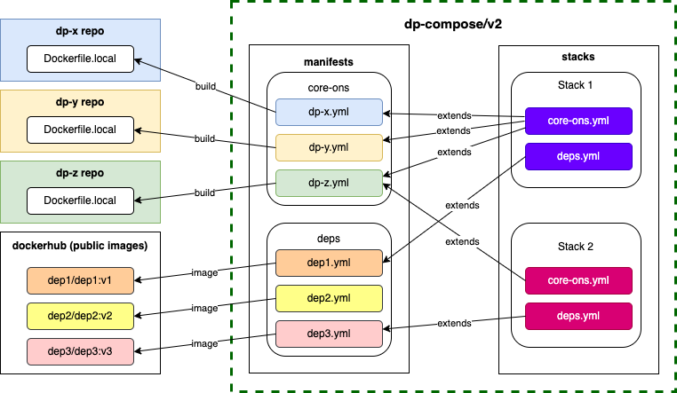

# v2

Motivation is to consolidate: 
- dp-compose (this repo)
- https://github.com/ONSdigital/dp-static-files-compose
- https://github.com/ONSdigital/dp-interactives-compose

And to create a structure that allows stacks to be easily modified or created.

Giving an end-to-end development environment for working with ONS services in a stable, reliable and repeatable way.

Eventually move this v2 directory as root - remove all other directories/files. So a single source of truth.

## Setup

Completely optional but it might be a good idea to clean the Docker environment - purge all containers/volumes/images and start fresh. Any issues then definitely give this a go first.

For everything to work as expected make sure of the following:

- `git clone` in same dir and level all relevant ONS repos in [manifests](manifests) dir (you will see errors if this is not as expected)
- optional: add an alias - something like `alias dpc='docker-compose --project-dir . -f profiles/static-files.yml'` this makes life a bit easier

## Usage

Each stack is independent from the other, and `make` or `docker` commands should be run from the root of the stack you want to use.

Please follow the instructions in [stacks README](./stacks/README.md) to run each stack.

Note that you should have the source code for all the ons dependencies of a stack cloned before the stack can be executed successfully.

Note that before starting a stack you should stop any other stack running.

## Structure

The required configs and scripts have been structured as follows:



### dockerfiles

Contains `Dockerfile.dp-compose` files for services that do not have a `Dockerfile.local` yet. Each repository should have its own `Dockerfile.local`, so this `dockerfiles` folder can be removed when this is the case.

### manifests

Contains docker compose config `yml` files for each service that is required by any of the stacks. These configurations are stack agnostic and define all the necessary env vars to run the services in any possible configuration that might be required by any stack. Each env var has a sensible default value, which will be used if not provided by the stack, and usually corresponds to the default value in the service config.

The files are organised in subfolders according to their type:

- core-ons: Core services implemented by ONS
- deps: Dependencies, not implemented by ONS, used by ONS services

### stacks

Contains definitions for each stack, including config overrides and docker compose extension files. Each stack should be independent form the other stacks, but they shoudl extends the required manifests, overwriting any env var required by the stack to work as expected.

Each subfolder corresponds to a particular stack and contains at least:

- {stack}.yml: Extended docker-compose file which uses the manifests for required services.
  - More information [here](https://docs.docker.com/compose/extends/)
- .env: With the environmental variables required to override the default config for the services in the stack
  - More information [here](https://docs.docker.com/compose/environment-variables/#using-the---env-file--option)

#### stack .env

Note that each `.env` file should be used only to override required env vars for that particular stack, and check that any compulsory env var for the stack is set (for example, most stacks will require your system to have `SERVICE_AUTH_TOKEN` and `zebedee_root`).

For example, the following .env file:
- checks for compulsory env vars
- defines relative paths to manifests and provisioning scripts
- overwrites default values used by the stack and/or extended manifests
- configures docker compose for the stack:

```sh
# -- Compulsory env vars validation --
zebedee_root=${zebedee_root:?please define a valid zebedee_root in your local system}
SERVICE_AUTH_TOKEN=${SERVICE_AUTH_TOKEN:?please define a valid SERVICE_AUTH_TOKEN in your local system}

# -- Paths --
PATH_MANIFESTS="../../manifests"
PATH_PROVISIONING="../../provisioning"

# -- Stack config env vars that override manifest defaults --
IS_PUBLISHING="false"

# -- Docker compose vars -- 
COMPOSE_FILE=deps.yml:core-ons.yml
COMPOSE_PATH_SEPARATOR=:
COMPOSE_PROJECT_NAME=home-web
COMPOSE_HTTP_TIMEOUT=120

```

### provisioning

Contains scripts and files to set the initial state required for stacks to work. This include things like database collections, content, etc.

## Kafka

Some stacks use KRaft mode, which is an early release: https://github.com/apache/kafka/blob/6d1d68617ecd023b787f54aafc24a4232663428d/config/kraft/README.md
